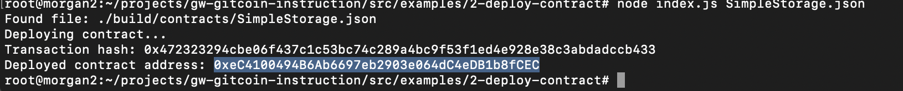

## 1. A screenshot of the console output immediately after you have successfully deployed a smart contract.

## 2. The transaction hash from the contract deployment (in text format).
0x472323294cbe06f437c1c53bc74c289a4bc9f53f1ed4e928e38c3abdadccb433
## 3. The deployed contract address from the contract deployment (in text format).
0xeC4100494B6Ab6697eb2903e064dC4eDB1b8fCEC
