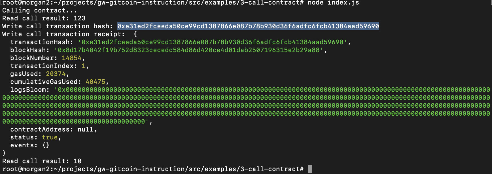

## 1. A screenshot of the console output immediately after you have successfully issued a smart contract call.

## 2. The transaction hash from the console output (in text format).
0xe31ed2fceeda50ce99cd1387866e087b78b930d36f6adfc6fcb41384aad59690
## 3. The contract address that you called (in text format).
0xeC4100494B6Ab6697eb2903e064dC4eDB1b8fCEC
## 4. The ABI for contract you made a call on (in text format).
```json
[
    {
      "inputs": [],
      "stateMutability": "payable",
      "type": "constructor"
    },
    {
      "inputs": [
        {
          "internalType": "uint256",
          "name": "x",
          "type": "uint256"
        }
      ],
      "name": "set",
      "outputs": [],
      "stateMutability": "payable",
      "type": "function"
    },
    {
      "inputs": [],
      "name": "get",
      "outputs": [
        {
          "internalType": "uint256",
          "name": "",
          "type": "uint256"
        }
      ],
      "stateMutability": "view",
      "type": "function"
    }
]
```
