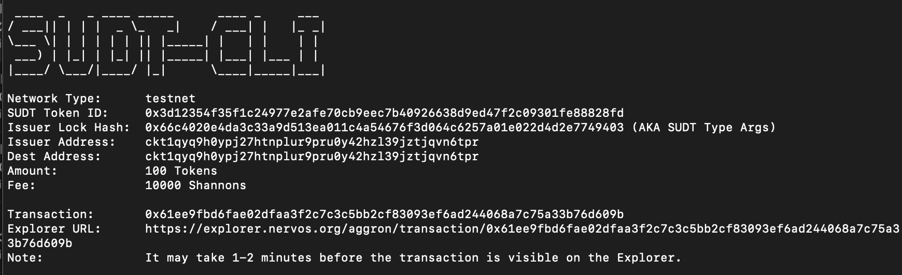
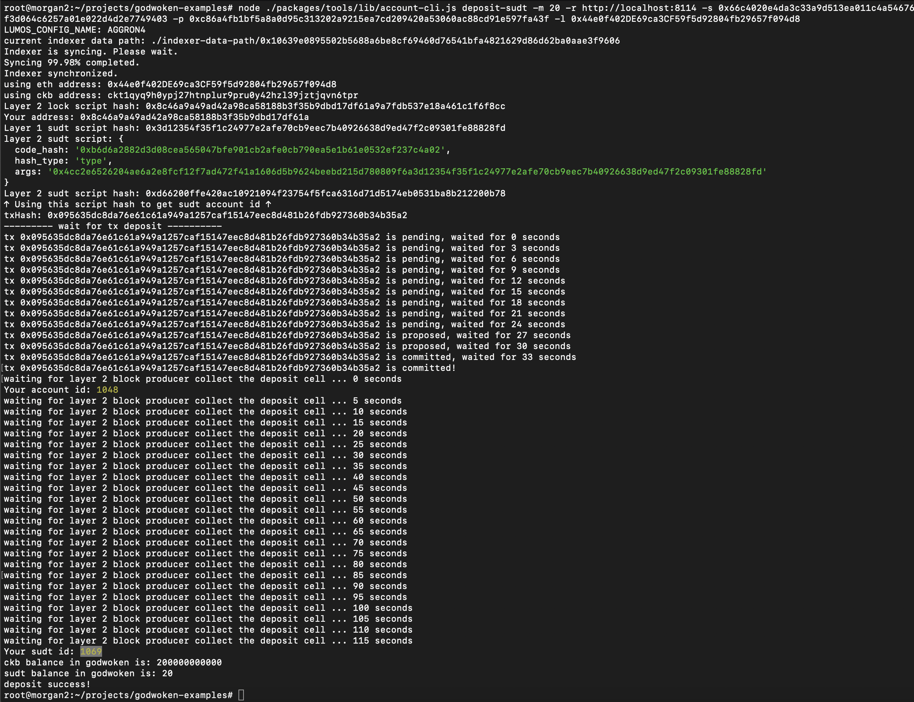

## 1. A link to the Layer 1 address you funded on the Testnet Explorer.
[https://explorer.nervos.org/aggron/address/ckt1qyq9h0ypj27htnplur9pru0y42hzl39jztjqvn6tpr](https://explorer.nervos.org/aggron/address/ckt1qyq9h0ypj27htnplur9pru0y42hzl39jztjqvn6tpr)
## 2. A screenshot of the console output immediately after using sudt-cli to create your SUDT tokens on Layer 1.

## 3. A link to the transaction ID created by sudt-cli on the Testnet Explorer.
[https://explorer.nervos.org/aggron/transaction/0x61ee9fbd6fae02dfaa3f2c7c3c5bb2cf83093ef6ad244068a7c75a33b76d609b](https://explorer.nervos.org/aggron/transaction/0x61ee9fbd6fae02dfaa3f2c7c3c5bb2cf83093ef6ad244068a7c75a33b76d609b)
## 4. A screenshot of the console output immediately after you have successfully submitted a deposit to Layer 2 using the account-cli tool.

## 5. The SUDT ID from the console output after executing the deposit script (in text format).
1069
