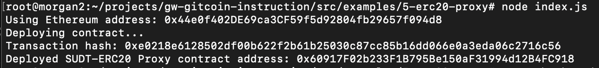
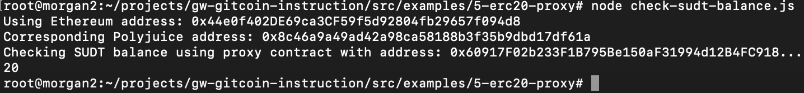

## 1. A screenshot of the console output immediately after deploying smart contract.
2

3
## 2. The address of the ERC20 Proxy Contract you deployed (in text format).
4
0x60917F02b233F1B795Be150aF31994d12B4FC918
5
## 3. A screenshot of the console output immediately after checking your SUDT balance.
6

7
## 4. The Ethereum address that was checked (in text format).
8
0x44e0f402DE69ca3CF59f5d92804fb29657f094d8
