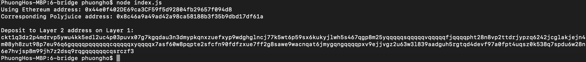

## 1. A screenshot of the console output immediately after you have successfully generated your Deposit Receiver Address.

## 2. Your Deposit Receiver Address (in text format).
ckt1q3dz2p4mdrvp5ywu4kk5edl2uc4p03puvx07g7kgqdau3n3dmypkqnxzuefxyp9wdghglncj77k5wt6p59sx6kukyjlwh5s467qgp8m25yqqqqqsqqqqqvqqqqqfjqqqqzwd88j2nf65mce83lknc36faejmd9pkh2ksw50dzy2pzdjavny4c6gqqqqpqqqqqqcqqqqqxyqqqqx7asf60w8pqpte2sfcfn90fdfzxue7ff2g8sawe9wacnqat6jmygqngqqqqpxv9ejjvgz2u63w3l839aadguh5rgtqd4devf97a0fpt4uqsz0k4hcal9adg7e0ghzt9dk89zusjkwune6ayq9rqgqqqqqqcq5svhj4
## 3. The Ethereum address used to generate the Deposit Receiver Address (in text format).
0xdF1DF97ad47b2F45C4B2B6C728b90959DC9e75d2
## 4. A link to the Etherscan explorer for the successful Force Bridge transaction. This can be found on Force Bridge under History→Succeed.
[https://rinkeby.etherscan.io/tx/0xd992b5a119d941b5ba6a706adac2b3d6d0d96d0e87b947479dc2d1a4cefbfcfa](https://rinkeby.etherscan.io/tx/0xd992b5a119d941b5ba6a706adac2b3d6d0d96d0e87b947479dc2d1a4cefbfcfa)
## 5. A link to the Nervos explorer for the successful Force bridge transaction. This can be found on Force Bridge under History→Succeed.
[https://explorer.nervos.org/aggron/transaction/0x6b7649b3600ec384b85c87a054ce81bec8b2db53b548a8c6438661189688f20f](https://explorer.nervos.org/aggron/transaction/0x6b7649b3600ec384b85c87a054ce81bec8b2db53b548a8c6438661189688f20f)
